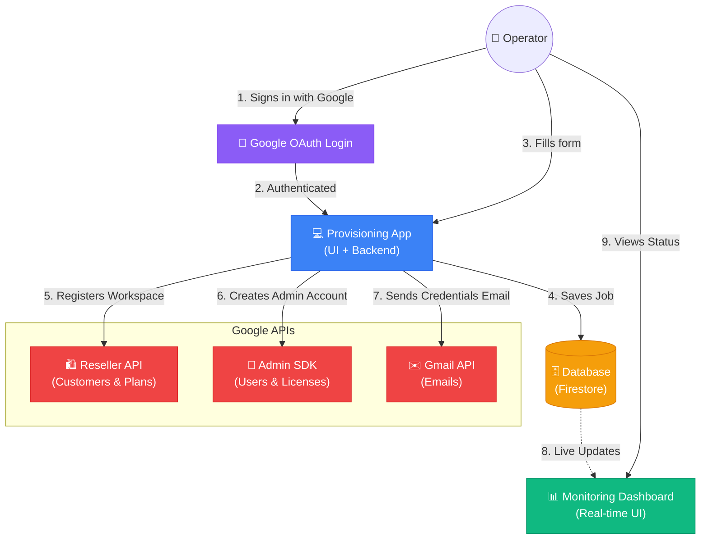

# Google Workspace Automated Provisioning System
**Technical Documentation**

---

## 1. Project Overview
This system automates Google Workspace customer onboarding for Google Workspace Resellers. Instead of manually navigating the Google Admin Console and Partner Sales Console, the operator fills a single web form and the system handles the rest via Google APIs.

### What This System Does (Step by Step):
1. Operator logs in with their Google email.
2. Operator enters: Company Name, Domain (already owned by customer), Admin Name, License Count, Plan Type.
3. System registers the domain as a new Google Workspace Customer via the Reseller API.
4. System creates a Subscription (Trial or Paid) with the requested number of licenses.
5. System creates one Admin user account (e.g., `admin@customerdomain.com`) with a temporary password.
6. System sends two emails:
   - **Email 1** → To the new admin: their login credentials.
   - **Email 2** → To the logged-in operator: provisioning summary and status.
7. The new admin then logs into `admin.google.com` and creates the remaining user accounts themselves.

### What This System Does NOT Do:
- It does NOT register/purchase internet domains. The customer must already own the domain.
- It does NOT create multiple user accounts. Only the first admin account is created; the admin manages the rest.

---

## 2. Tech Stack
| Component | Technology |
|-----------|-----------|
| Frontend | HTML5, CSS3, Vanilla JavaScript |
| Backend | Python 3, FastAPI (async) |
| Database | Google Cloud Firestore |
| Authentication | Google OAuth (Sign in with Google) |
| Background Jobs | FastAPI BackgroundTasks |
| API Abstraction | Adapter Pattern (Mock for testing, Google for production) |

---

## 3. High-Level Design (Architecture)



### Flow Summary:
1. **Operator logs in** via Google OAuth (Sign in with Google).
2. **App authenticates** the operator and stores their email for notifications.
3. **Operator fills the form** with company name, domain, admin name, and license count.
4. **Backend** saves the job to Firestore and returns immediately.
5. **Background Worker** calls Google APIs in sequence:
   - Reseller API → Registers the customer's existing domain as a Workspace Customer and creates a subscription.
   - Admin SDK → Creates the admin user account and assigns a license.
   - Gmail API → Sends credential email to the new admin and status email to the operator.
6. **Dashboard** displays live progress and final results from Firestore.

---

## 4. Google APIs Used

| API | OAuth Scope | What It Does |
|-----|------------|--------------|
| Google Workspace Reseller API | `https://www.googleapis.com/auth/apps.order` | Registers customer domain, creates subscription (Trial/Flexible) |
| Admin SDK Directory API | `https://www.googleapis.com/auth/admin.directory.user` | Creates the admin user account, sets temporary password |
| Enterprise License Manager API | `https://www.googleapis.com/auth/apps.licensing` | Assigns Google Workspace license to the created admin |
| Gmail API | `https://www.googleapis.com/auth/gmail.send` | Sends credential email to new admin, status email to operator |

---

## 5. Business Prerequisite

The organization running this tool **must be a registered Google Workspace Reseller** enrolled in the Google Cloud Partner Advantage program. The Reseller API is not available to non-reseller organizations. If the GCP project is not linked to a Reseller account, the API will return `403 Forbidden`.

---

## 6. How Authentication Works

This system uses a **Service Account** with **Domain-Wide Delegation (DWD)** to call Google APIs.

- A **Service Account** is a machine identity (not a human account). It is created inside a GCP project.
- **Domain-Wide Delegation** is a permission granted by a Workspace Super Admin that allows the service account to act on behalf of a specific human admin account.
- Without DWD, the service account has no permission to call any Workspace API — even if the APIs are enabled.

DWD can only be configured through the Google Workspace Admin Console (`admin.google.com`). There is no CLI or API to set it up.

---

## 7. Access Requirements — Two Methods

### Method A: Use Admin's Email (Minimal Access)
The service account impersonates the reseller admin's email. You do NOT need Super Admin on your own account.

**What you need from the Admin:**

| # | What | Where Admin Does It |
|---|------|-------------------|
| 1 | Domain-Wide Delegation for your service account (4 scopes) | `admin.google.com` → Security → API Controls → Domain-Wide Delegation |
| 2 | The admin's email address (e.g., `admin@econz.net`) | Admin tells you |
| 3 | Partner Sales Console viewer access (optional, to see created customers) | `partnersales.google.com` → Settings → Add User |

**Your `.env` configuration:**
```env
SERVICE_ADAPTER=google
GOOGLE_ADMIN_EMAIL=admin@econz.net
```

**What you CAN do:**
- Run the provisioning tool (creates customers, subscriptions, admin accounts, sends emails)
- See job history in your app dashboard
- See created customers in Partner Sales Console (if viewer access granted)

**What you CANNOT do:**
- Login to `admin.google.com` to see created user accounts and licenses directly

---

### Method B: Get Super Admin Role (Full Visibility)
Your own email gets Super Admin privileges, and the service account impersonates your email.

**What you need from the Admin:**

| # | What | Where Admin Does It |
|---|------|-------------------|
| 1 | Domain-Wide Delegation for your service account (4 scopes) | `admin.google.com` → Security → API Controls → Domain-Wide Delegation |
| 2 | Super Admin role assigned to your email | `admin.google.com` → Directory → Users → Your email → Assign Super Admin |
| 3 | Partner Sales Console access | `partnersales.google.com` → Settings → Add User |

**Your `.env` configuration:**
```env
SERVICE_ADAPTER=google
GOOGLE_ADMIN_EMAIL=ratnesh.s@econz.net
```

**What you CAN do:**
- Everything from Method A, PLUS:
- Login to `admin.google.com` and see all created user accounts
- See assigned licenses
- See domain verification status
- Full visibility into everything Google-side

---

### Comparison Table

| Capability | Method A (Admin's Email) | Method B (Super Admin) |
|-----------|------------------------|----------------------|
| Tool works (create customers, users, send emails) | ✅ Yes | ✅ Yes |
| See results in your app dashboard | ✅ Yes | ✅ Yes |
| See customers in Partner Sales Console | ✅ If viewer access given | ✅ Yes |
| See users in `admin.google.com` | ❌ No | ✅ Yes |
| See licenses in `admin.google.com` | ❌ No | ✅ Yes |
| Total asks from admin | 2-3 things | 3 things |

---

## 8. DWD Setup Instructions (For the Admin)

This is the exact same step for both Method A and Method B.

1. Open: `https://admin.google.com/ac/owl/domainwidedelegation`
2. Click **"Add new"**
3. Enter **Client ID**: *(the numeric Client ID of the service account)*
4. Enter **OAuth Scopes** (comma-separated, no spaces):
```
https://www.googleapis.com/auth/apps.order,https://www.googleapis.com/auth/admin.directory.user,https://www.googleapis.com/auth/apps.licensing,https://www.googleapis.com/auth/gmail.send
```
5. Click **Authorize**

This is a one-time setup. Once authorized, the service account can call all four APIs immediately.

---

## 9. Switching From Mock to Production

The system uses an Adapter Pattern. During development, all Google API calls are simulated by a mock adapter. To switch to real Google APIs:

**Change one value in `.env`:**
```env
# Development (current)
SERVICE_ADAPTER=mock

# Production
SERVICE_ADAPTER=google
```

No code changes are required. The same frontend, backend, and database work with both adapters.

---

## 10. Monitoring Dashboard

After provisioning, the web app provides a live dashboard showing:
- Company name and domain
- Customer ID and Subscription ID
- Number of licenses granted
- Admin account created (email)
- Email delivery status (sent / failed)
- Overall job status (Completed / Failed / Partial)
- Step-by-step progress timeline

This dashboard pulls data from Firestore, so all results are visible regardless of whether you have Super Admin access to Google's own consoles.
